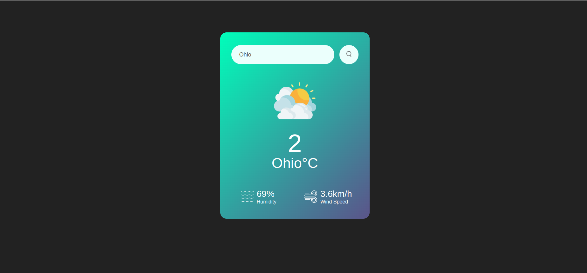
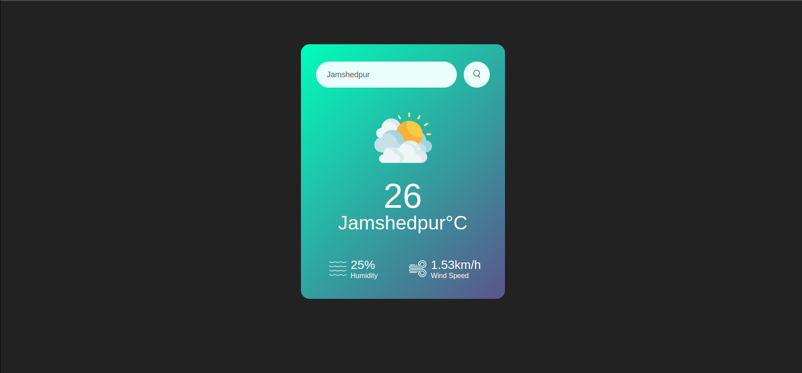

# WeatherVane
Simple weather application created using HTML, CSS and JavaScript

## Setup ⚙️
**Clone** the repository into your local machine
```
git clone https://github.com/IAmRiteshKoushik/WeatherVane.git
```
**Generate** API Keys from [OpenWeather-API](https://openweathermap.org/) platform. Then alter the first line of `script.js`
```JavaScript
const apiKey = "Your apiKey here";
```
Open the index.html file in Web Browser!  

## Screenshots 📷
**EXAMPLE:** Getting the weather data of Ohio, Canada.

**EXAMPLE:** Getting the weather data of Jamshedpur, India.


## Tutorial Reference ➕
Make a [Weather Application](https://www.youtube.com/watch?v=MIYQR-Ybrn4) using HTML5, CSS3 and JavaScript.
